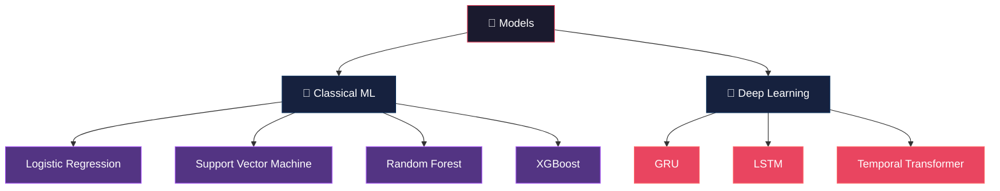
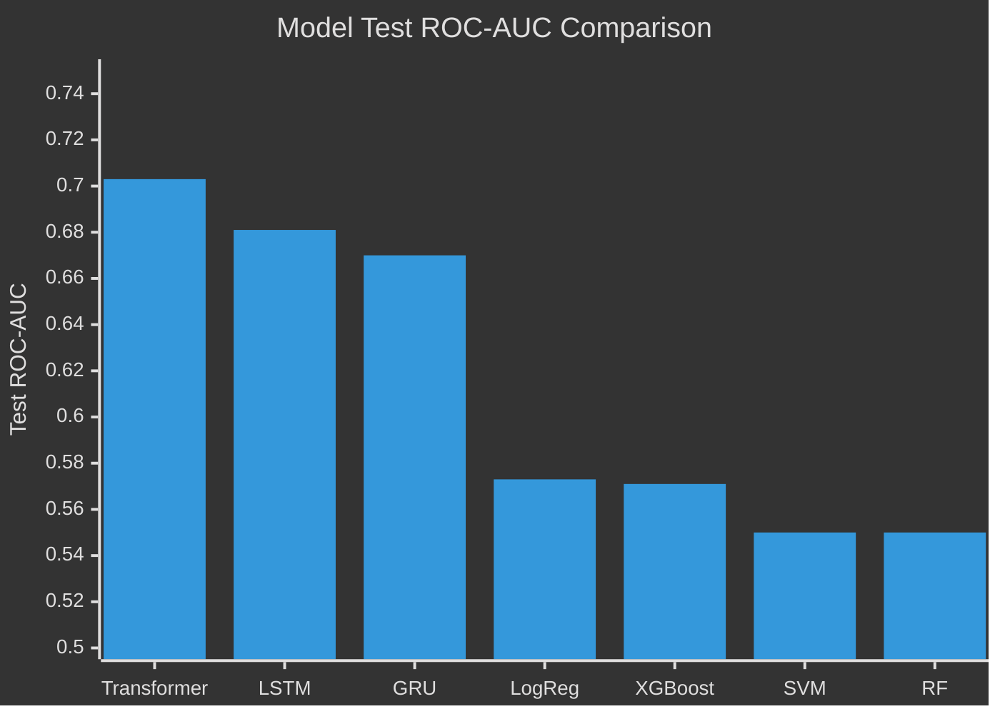
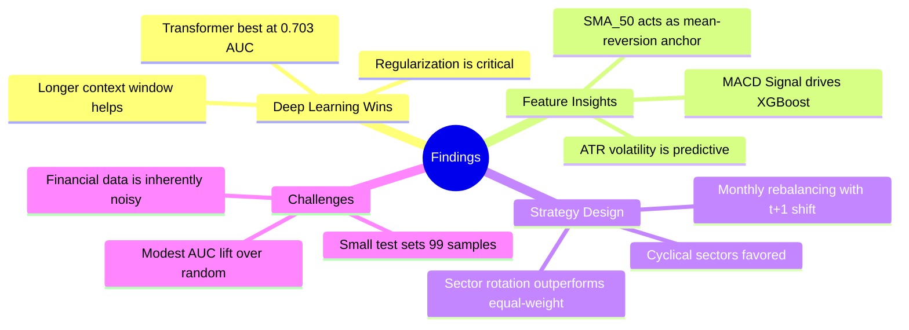

<div align="center">

# 📈 Algorithmic Portfolio Selection with Machine Learning

### *Predicting Sector Trends & Optimizing Portfolio Allocation Using ML and Deep Learning*


---

*A comprehensive comparison of **7 machine learning and deep learning models** for sector-level trend prediction and long-only portfolio allocation across **11 S&P 500 sectors**, spanning **7 years** of daily market data.*

[Models](#-models--results) · [Results](#-model-comparison) · [Strategy](#-portfolio-strategy--backtesting) · [Setup](#-getting-started)

</div>

---

## 🔍 Project Overview

This project investigates whether machine learning models can predict **next-month sector trends** and translate those predictions into a profitable **long-only sector rotation strategy**. We benchmark 7 models — from classical ML to deep learning — against an equal-weight sector benchmark (SPY proxy).

### Key Questions
- Can ML models predict whether a sector will rise or fall next month?
- Which model family (linear, tree-based, recurrent, attention-based) performs best?
- Do ML-driven sector rotation strategies outperform a passive equal-weight benchmark?

---

## 🏗️ Pipeline Architecture


---

## 📊 Data

| Property | Detail |
|---|---|
| **Universe** | 220 stocks across 11 GICS sectors (S&P 500 constituents) |
| **Period** | October 2018 – October 2025 (~7 years) |
| **Granularity** | Daily OHLCV data |
| **Rows** | 377,679 daily observations |
| **Features** | 14 technical indicators per stock |

### Technical Indicators Used

| Category | Indicators |
|---|---|
| **Trend** | SMA₂₀, SMA₅₀, EMA₁₂, EMA₂₆ |
| **Momentum** | RSI₁₄, MACD, MACD Signal, MACD Histogram |
| **Volatility** | Bollinger Bands (Upper/Mid/Lower), ATR₁₄ |
| **Returns** | Daily Return, Log Return |

### Sectors Covered

> Communication Services · Consumer Discretionary · Consumer Staples · Energy · Financials · Health Care · Industrials · Information Technology · Materials · Real Estate · Utilities

---

## 🤖 Models & Results

### Model Categories



---

### 1️⃣ Support Vector Machine (SVR)

> **Task:** Regression on daily returns → directional classification via sign of prediction

| Metric | Value |
|---|---|
| Kernel | Linear |
| MAE | See notebook |
| ROC Curve | Computed on directional (up/down) classification |
| Strategy | QuantStats tearsheet generated |

**Approach:** SVR predicts raw return values; direction is inferred from the sign. Monthly sector-level aggregation feeds a next-month rebalancing strategy.

📓 *Notebook:* [`models/SVM_Edited/SVM_Edited.ipynb`](models/SVM_Edited/SVM_Edited.ipynb)

---

### 2️⃣ Random Forest

> **Task:** Regression on daily returns with hyperparameter tuning via RandomizedSearchCV

| Metric | Value |
|---|---|
| Tuning | RandomizedSearchCV (20 iterations, 5-fold CV) |
| Features | RSI₁₄, MACD, ATR₁₄, MACD Histogram, Volume, MACD Signal |
| ROC Curve | Directional classification from predicted returns |
| Strategy | QuantStats tearsheet generated |

**Best Hyperparameters** (from RandomizedSearchCV):

| Parameter | Value |
|---|---|
| `n_estimators` | Tuned over [100, 200] |
| `max_depth` | Tuned over [None, 10, 20] |
| `min_samples_split` | Tuned over [2, 10, 20] |
| `min_samples_leaf` | Tuned over [2, 5, 10] |
| `max_features` | Tuned over [log2, sqrt, none] |

📓 *Notebook:* [`models/RandomForest/RF_Edited.ipynb`](models/RandomForest/RF_Edited.ipynb)

---

### 3️⃣ Logistic Regression

> **Task:** Binary classification — will the stock return be positive in the next 30 days?

| Metric | Value |
|---|---|
| Training Window | Rolling 365-day window |
| Rebalance Freq | Every 30 days |
| Prediction Horizon | 30 days forward |
| Target Distribution | 56.4% Up / 43.6% Down |

**Key Feature Coefficients:**

| Feature | Coefficient | Interpretation |
|---|---|---|
| BB_Upper | ≈ +0.5 | Most powerful positive predictor |
| ATR₁₄ | ≈ +0.5 | High volatility → upward momentum |
| SMA₅₀ | ≈ −2.0 | Strongest negative — penalizes overextended stocks |
| LogReturn | ≈ −0.1 | Mean-reversion signal |

**Sector Allocation:** Favors cyclical sectors (Consumer Discretionary, Communication Services, Energy). Avoids defensive sectors (IT, Health Care) based on indicator signals.

📓 *Notebook:* [`models/LogRegression_XGBoost/Akiko Analysis.ipynb`](models/LogRegression_XGBoost/Akiko%20Analysis.ipynb)

---

### 4️⃣ XGBoost

> **Task:** Binary classification — same 30-day forward prediction as Logistic Regression

| Metric | Value |
|---|---|
| Training Window | Rolling 365-day window |
| Rebalance Freq | Every 30 days |
| Prediction Horizon | 30 days forward |

**Feature Importance (by Gain):**

| Rank | Feature | Importance | Role |
|---|---|---|---|
| 1 | MACD Signal | ~50 | Trend-following signal |
| 2 | ATR₁₄ | ~50 | Volatility awareness |
| 3 | BB Lower | ~38 | Oversold / volatility contraction |
| 4–7 | SMA₅₀, EMA₁₂, EMA₂₆, BB Upper | ~30–35 | Medium-term trend |
| 8–10 | Return, MACD Hist, SMA₂₀ | ~25–30 | Short-term trend persistence |

**Interpretation:** XGBoost learns a **trend-momentum + volatility-adjusted** strategy. The decision tree logic is essentially: *"If MACD shows strong negative momentum AND ATR is high → allocate conservatively."*

📓 *Notebook:* [`models/LogRegression_XGBoost/Akiko Analysis.ipynb`](models/LogRegression_XGBoost/Akiko%20Analysis.ipynb)

---

### 5️⃣ GRU (Gated Recurrent Unit)

> **Task:** Sector-level binary classification — will the sector trend up next month?

| Metric | Value |
|---|---|
| Input Shape | `[N, 3, 8]` — 3 monthly time steps, 8 features |
| Train Period | Jan 2019 – Dec 2024 (792 samples) |
| Test Period | Jan 2025 – Sep 2025 (99 samples) |
| Grid Search | 432 configurations |

**Best Hyperparameters:**

| Parameter | Value |
|---|---|
| Hidden Size | 8 |
| Dropout | 0.2 |
| Learning Rate | 0.001 |
| Num Layers | 2 |

**Results:**

| Metric | Train | Test |
|---|---|---|
| **ROC-AUC** | 0.694 | **0.670** |

Training used **50 random restarts** with early stopping (patience=3) and gradient clipping to ensure stability.

📓 *Notebook:* [`models/GRU/GRU.ipynb`](models/GRU/GRU.ipynb)

---

### 6️⃣ LSTM (Long Short-Term Memory)

> **Task:** Sector-level binary classification — identical setup to GRU

| Metric | Value |
|---|---|
| Input Shape | `[N, 3, 8]` — 3 monthly time steps, 8 features |
| Train Period | Jan 2019 – Dec 2024 (792 samples) |
| Test Period | Jan 2025 – Sep 2025 (99 samples) |
| Grid Search | 432 configurations |

**Best Hyperparameters:**

| Parameter | Value |
|---|---|
| Hidden Size | 4 |
| Dropout | 0.8 |
| Learning Rate | 0.0003 |
| Num Layers | 1 |

**Results:**

| Metric | Train | Test |
|---|---|---|
| **ROC-AUC** | 0.581 | **0.681** |

The high dropout (0.8) and small hidden size (4) suggest strong regularization is needed to avoid overfitting on noisy financial data.

📓 *Notebook:* [`models/LSTM/LSTM.ipynb`](models/LSTM/LSTM.ipynb)

---

### 7️⃣ Temporal Transformer

> **Task:** Sector-level binary classification with 12-month rolling input sequences

| Metric | Value |
|---|---|
| Input Shape | `[N, 12, 8]` — 12 monthly time steps, 8 features |
| Architecture | Linear embed → Positional Encoding → Transformer Encoder → CLS pooling → MLP |
| Train Period | Sep 2019 – Dec 2024 (704 samples) |
| Test Period | Jan 2025 – Sep 2025 (99 samples) |
| Grid Search | 648 configurations |

**Best Hyperparameters:**

| Parameter | Value |
|---|---|
| d_model | 96 |
| nhead | 2 |
| dim_feedforward | 128 |
| Dropout | 0.3 |
| Num Layers | 2 |
| Learning Rate | 0.001 |
| Pooling | CLS token |

**Results:**

| Metric | Train | Test |
|---|---|---|
| **ROC-AUC** | 0.754 | **0.703** |

The Transformer leverages **12 months of historical context** (vs. 3 for GRU/LSTM), using self-attention to capture long-range temporal dependencies in sector behavior.

📓 *Notebook:* [`models/Transformer/TemporalTransformer.ipynb`](models/Transformer/TemporalTransformer.ipynb)

---

## 🏆 Model Comparison

### Test ROC-AUC Ranking



### Summary Table

| Rank | Model | Type | Test AUC | Input Granularity | Key Strength |
|:---:|---|---|:---:|---|---|
| 🥇 | **Temporal Transformer** | Deep Learning | **0.703** | 12-month sector sequences | Long-range attention over temporal patterns |
| 🥈 | **LSTM** | Deep Learning | **0.681** | 3-month sector sequences | Strong regularization prevents overfitting |
| 🥉 | **GRU** | Deep Learning | **0.670** | 3-month sector sequences | Efficient recurrent architecture |
| 4 | Logistic Regression | Classical ML | 0.573 | Stock-level daily | Interpretable linear coefficients |
| 5 | XGBoost | Classical ML | 0.571 | Stock-level daily | Feature importance & nonlinear interactions |
| 6 | SVM (SVR) | Classical ML | ~0.55 | Stock-level daily | Regression-based direction inference |
| 7 | Random Forest | Classical ML | ~0.55 | Stock-level daily | Ensemble averaging with tuned hyperparams |

### Key Takeaways



---

## 💰 Portfolio Strategy & Backtesting

### Strategy Design

Each model's predictions are converted into a **long-only sector rotation** strategy:

1. **Signal Generation:** Predict next-month sector direction (up/down)
2. **Look-Ahead Prevention:** Signals from month *t* are applied in month *t+1*
3. **Allocation Rule:** Equal-weight across sectors predicted to go up; cash if none
4. **Benchmark:** Equal-weight across all 11 sectors every day

### Strategy Flow


### Reports

Full QuantStats HTML tearsheets are generated for each model strategy. See the [`reports/`](reports/) folder and individual model notebooks for:
- Cumulative return curves (Strategy vs. Benchmark)
- Drawdown analysis
- Monthly return heatmaps
- Sharpe ratio, Sortino ratio, Max Drawdown
- Rolling volatility and beta

---

## 📁 Project Structure

```
ML/
├── 📄 README.md                          ← You are here
├── 📋 requirements.txt                   ← Python dependencies
├── 📜 LICENSE                            ← MIT License
│
├── 🤖 models/
│   ├── SVM_Edited/
│   │   └── SVM_Edited.ipynb              ← Support Vector Regression
│   ├── RandomForest/
│   │   └── RF_Edited.ipynb               ← Random Forest Regressor
│   ├── LogRegression_XGBoost/
│   │   └── Akiko Analysis.ipynb          ← Logistic Regression + XGBoost
│   ├── GRU/
│   │   └── GRU.ipynb                     ← Gated Recurrent Unit
│   ├── LSTM/
│   │   └── LSTM.ipynb                    ← Long Short-Term Memory
│   └── Transformer/
│       └── TemporalTransformer.ipynb     ← Temporal Transformer (CLS pooling)
│
├── 📊 data/
│   ├── raw/
│   │   ├── ohlcv/ohlcv_daily.parquet     ← Raw OHLCV price data
│   │   └── sector_20stocks.csv           ← Stock universe definition
│   └── processed/
│       ├── indicators_daily.csv          ← Engineered features
│       └── crosslib_validation_summary.csv
│
├── 📈 reports/
│   └── pypfopt_tearsheet.html            ← Portfolio optimization report
│
├── 🔧 backtest/
│   ├── backtester.py                     ← Backtesting engine
│   └── __init__.py
│
├── 🛠️ utils/
│   └── universe/
│       ├── validate.py                   ← Data validation utilities
│       └── alpaca_download.py            ← Market data downloader (Alpaca API)
│
└── 📚 extra/
    ├── Universe_Creation.py              ← Stock universe construction
    ├── core.py                           ← Core utility functions
    ├── cli.py                            ← Command-line interface
    └── adapters.py                       ← Data source adapters
```

---

## 🚀 Getting Started

### Prerequisites

- Python 3.10+
- pip

### Installation

```bash
# Clone the repository
git clone https://github.com/your-username/ML-Portfolio-Selection.git
cd ML-Portfolio-Selection

# Install dependencies
pip install -r requirements.txt
```

### Running the Models

Each model is a self-contained Jupyter notebook. Open any notebook and run all cells:

```bash
jupyter notebook models/Transformer/TemporalTransformer.ipynb
```

### Key Dependencies

| Package | Purpose |
|---|---|
| `pandas`, `numpy` | Data manipulation |
| `scikit-learn` | Classical ML models, preprocessing, metrics |
| `xgboost` | Gradient boosted trees |
| `torch` | Deep learning (GRU, LSTM, Transformer) |
| `quantstats` | Strategy performance tearsheets |
| `matplotlib`, `seaborn` | Visualization |

---

## 🧪 Methodology Notes

- **No data leakage:** All models use strict chronological train/test splits. Deep learning models shift signals to *t+1* for trading to prevent look-ahead bias.
- **Class imbalance handling:** BCEWithLogitsLoss with `pos_weight` for deep learning; natural class balance (~56/44) for classical models.
- **Hyperparameter search:** Grid/random search with cross-validation for classical models; exhaustive grid search with multi-restart + early stopping for deep learning.
- **Robustness:** Deep learning models use 50 random restarts with early stopping to mitigate initialization sensitivity.

---

<div align="center">

### Built with 🧠 at NTU Singapore

*MH6805 — Machine Learning in Finance*

</div>
